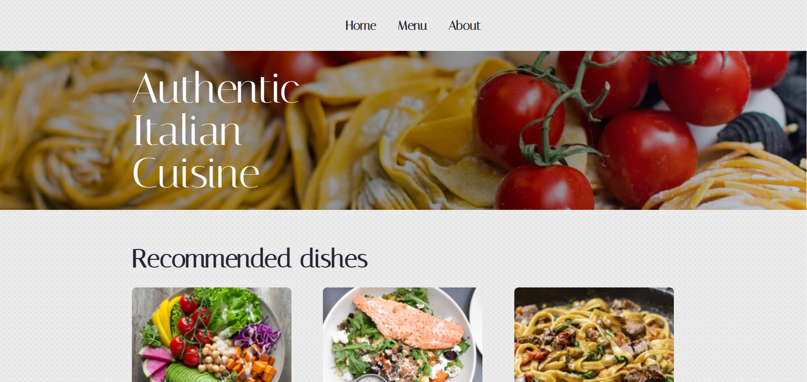

# La pasta restaurant

Um site fictício de restaurante italiano feito com React e Typescript!

## Visite o Site

O site está atualmente hospedado na Vercel e pode ser acessado através do seguinte link:

* https://la-pasta-restaurant.vercel.app/



### Funcionalidades

- Busca por pratos digitando o nome
- Ordenamento dos pratos por porção, preço e quantas pessoas serve
- Categorias dos tipos de prato
- SPA responsiva
  
### Bibliotecas Utilizadas

- [react-icons](https://react-icons.github.io/react-icons/)
- [classNames](https://www.npmjs.com/package/classnames/)
- [styled-components](https://styled-components.com/)
- [ESLint](https://eslint.org/)
- [react-router-dom](https://www.npmjs.com/package/react-router-dom)


## Como Instalar e Executar o Projeto na Sua Máquina

### Passo 1 - Requisitos

Você vai precisar de:
* [Git](http://git-scm.com/downloads)
* [node](https://nodejs.org/)
* [npm packages](https://www.npmjs.com/)

Please install them if you don't have them already.

### Passo 2 - Clone o repositório

```sh
$ git clone https://github.com/mylenaverspeelt/la-pasta-restaurant.git
```

### Passo 3 - Rode a aplicação

- Certifique de estar na pasta raiz do projeto

```sh
cd la-pasta-restaurant
```
- Instale as  as dependências do projeto

```sh
npm install
```

- Inicie o servidor React

```sh
npm start
```

O projeto estará disponível em localhost:3000 :)

PS: Se ao rodar o projeto o ESLint apontar alguma questão, você pode corrigi-la facilmente executando o seguinte comando:

```sh
npx eslint ./src --fix
```
Isso garantirá que o código siga o padrão definido pelo ESLint e mantenha a consistência em todo o projeto

### Repositórios originais

Este projeto foi desenvolvido durante a trilha de Typscript + React da Alura. Você pode acessar o repositorio original nos seguintes links:

- [aluroni-introducao](https://github.com/alura-cursos/aluroni-introducao)
- [aluroni-router](https://github.com/alura-cursos/aluroni-router)
- [aluroni-performance](https://github.com/alura-cursos/aluroni-performance)


 
